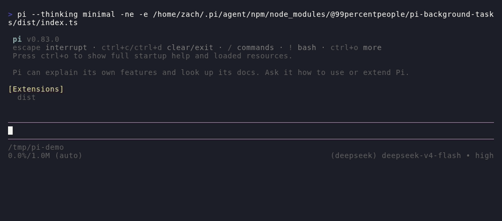

# @99percentpeople/pi-background-tasks

Run long-lived commands alongside the [Pi coding agent](https://pi.dev/) without
blocking the current conversation. The extension supports ordinary background
processes as well as full PTY-backed terminal applications, with live status,
retained output, interactive attach, and completion-aware cleanup.

Just ask Pi to *"start the dev server in the background"* — then keep
chatting while it runs. `bg_*` tools start, wait on, inspect, and stop tasks;
`/bg-attach` opens a live terminal you can interact with (`Ctrl+]` to leave).

## Demo

Ask Pi to start a server in the background — the task keeps running while
you chat, and the status widget tracks it:



## Features

- Run builds, servers, watchers, tests, and terminal applications in the background
- Choose lightweight `pipe` mode or a real pseudo-terminal with `pty` mode
- Keep consuming and retaining output even when no user is attached
- Attach without pausing or redirecting the child process
- Replay earlier output before switching seamlessly to live output
- Interact with PTY applications using keyboard, mouse, focus, and resize events
- Inspect separate stdout/stderr logs for pipe tasks or a parsed terminal screen for PTY tasks
- Wait explicitly for task completion without repeated polling
- Require unique task names while tasks remain retained, preventing ambiguous references
- Keep final output available long enough for both the user and model to inspect it
- Track task status, duration, and recent output in a compact expandable widget
- Send text, terminal keys, stdin data, and process signals to running tasks
- Use the same shell resolution and command syntax as Pi's built-in `bash` tool

## Install

```bash
pi install npm:@99percentpeople/pi-background-tasks
```

During local development:

```bash
pi -e ./extensions/background-tasks/index.ts
```

## Typical workflow

Ask Pi to start a command in the background, then continue working while it
runs. For example:

```text
Run the development server in the background and tell me when it is ready.
Start lazygit in a background PTY so I can attach to it.
Run the test suite in the background and inspect the failures when it exits.
```

The model can start, wait for, inspect, signal, and stop tasks. Model-facing
tools have narrow responsibilities: `bg_wait` reports completion, `bg_status`
reports metadata, `bg_logs` reads output, and `bg_kill` reports termination.
Users normally only need the two interactive commands:

```text
/bg-attach <task-id>
/bg-kill <task-id>
```

Omit the task ID to choose from an interactive list. Press `Ctrl+]` to leave an
attached console without stopping its task.

## Tool ordering and parallelism

Background tool calls that target the same task ID in one model response execute
strictly in source order. Calls for different task IDs remain independent and
can execute in parallel. This supports composable workflows without making one
tool perform another tool's job:

```text
bg_wait(A) → bg_logs(A)                 # wait, then read final/current-at-timeout output
bg_send(A) → bg_wait(A) → bg_logs(A)   # interact, wait, then read output
bg_kill(A) → bg_logs(A)                 # terminate, then read final output
```

The ordering is intentional. `bg_logs(A) → bg_wait(A)` reads the output that is
available first and only then begins waiting. Multiple chains such as
`bg_wait(A) → bg_logs(A)` and `bg_wait(B) → bg_logs(B)` can run concurrently.
A `bg_status` call without an ID is a global snapshot and is not part of any
single-task chain.

## Pipe and PTY modes

| | Pipe mode | PTY mode |
| --- | --- | --- |
| Best for | Builds, servers, scripts, tests, and watchers | TUIs, REPLs, debuggers, and terminal-aware programs |
| Output model | Separate stdout and stderr logs | One terminal screen with ANSI control sequences interpreted |
| Attached view | Combined stdout/stderr in arrival order | Live virtual terminal |
| Direct attached input | Read-only; send stdin through Pi | Keyboard and mouse input are forwarded |
| Resize behavior | Local console reflow only | Debounced terminal and child-process resize |

Pipe mode is the simpler default for commands that only need reliable logs.
PTY mode sets up a real pseudo-terminal, so programs can detect terminal
capabilities, redraw their screen, request mouse tracking, and respond to window
size changes as they would in a standalone terminal.

## Live attach and final snapshots

Each task owns a virtual console from the moment it starts. Output is processed
continuously whether attached or not. When `/bg-attach` opens the console, it
first renders the retained terminal buffer and buffers only the small amount of
output arriving during that replay. The child process is never paused and its
stdout or stderr is never reconnected to the physical terminal.

For PTY applications, attach forwards keyboard input and terminal resize events.
Extended mouse encodings, including SGR and SGR pixel mode, are restored when
the application enables them. Mouse tracking, encodings, and focus modes are
reset on detach so terminal state does not leak back into Pi.

If a task exits while attached, the console stays open until `Ctrl+]`:

- pipe mode appends a completion message;
- PTY mode overlays the message in the bottom-right corner without changing the
  application's final screen.

The completion message exists only on the user's physical terminal. It is not
written into retained logs, `bg_logs`, or the final virtual-terminal snapshot.
A finished task can be attached again in read-only mode while its snapshot is
still retained.

## Status widget

Pi displays background tasks below the editor with their status, duration, and
latest pipe output. The collapsed widget shows only the task totals so it stays
out of the way by default. Pi's standard tool expansion shortcut (`Ctrl+O` by
default) reveals the complete task list. Finished pipe tasks include their
latest output in the expanded view; finished PTY tasks keep the list compact
because their final screen remains available through attach or explicit logs.

The header uses separate colors for the total, running, and finished counts so
active work stands out without making the whole widget look like a warning.
Running durations and recent output refresh without repeatedly registering a
new widget.

## Output retention and cleanup

Within the current session, a running task continues across ordinary agent
runs and remains available to the background tools. Reloading or shutting down
the session terminates running tasks.

If a task finishes before the current agent run settles, its final status and
retained output remain available only for the rest of that run and are normally
removed before the next run starts. Only a task that is still running when the
agent settles and then finishes while the agent is idle remains available
throughout the next agent run. It can be inspected multiple times during that
run and is normally removed before the following run.

Once removed, the old task ID is no longer available through attach, status,
logs, or wait operations. Task names must be unique (case-insensitively) among
all retained running and finished tasks; a name becomes available again when its
old task is removed by this cleanup lifecycle. Completed snapshots are
checkpointed as hidden Pi session entries, so reloading the extension or
navigating the session tree does not clear them early. Cleanup writes a matching
session event, so an expired snapshot cannot reappear after another reload.

Live pipe stdout and stderr remain in memory and are capped at 4 MiB each, with
the oldest bytes discarded when that limit is reached. A persisted pipe
snapshot keeps the latest 500 lines, capped at 256 KiB per stream. The attached
console snapshot keeps 200 lines of scrollback and is capped at 512 KiB. No task
output is written to a temporary disk directory. This is not persistent job
management: reload restores only completed read-only snapshots, while session
shutdown still terminates running processes and disposes live virtual terminals
so it does not leave orphaned tasks.

## Sending input and keys

Pi can send ordinary text, terminal keys, or signals without opening an attached
console. Text is exact and never implies Enter. Special keys use `<...>` tokens:

```text
<C-o>filename.txt<Enter>
<Esc>iHello<Enter>
<Down*3><Enter>
```

The input syntax supports Ctrl+A-Z and Ctrl punctuation, Alt/Meta combinations,
arrows, navigation keys, Insert/Delete, F1-F12, Space, Enter, Escape, Tab, and
Backspace. Modifiers can be combined, such as `<C-A-d>` or `<S-A-Left>`, and
key repetition uses forms such as `<Down*3>`. Use `\<` for a literal `<` and
`\\` for a literal backslash.

Pipe attachments do not forward keyboard input directly, but Pi can still send
stdin through the background task interface. PTY attachments forward input
interactively and the same key syntax remains available for model-driven input.

The signal input accepts every named signal exposed by Node.js for the current
operating system and sends it to the task's process group on Unix. Signal
availability and behavior remain platform-specific; Windows processes and
Windows PTYs support a smaller set of effective signal behaviors. Use the
dedicated kill operation when the goal is reliable process-tree termination.

## Output inspection

`bg_logs` is the only model-facing tool that returns process output. Pipe tasks
retain stdout and stderr separately, while PTY tasks expose the parsed terminal
buffer rather than raw ANSI escape sequences. Omitting `stream` works in both
modes: pipe tasks return stdout and stderr, and PTY tasks return terminal output.
Use `tail` or `from_line`/`max_lines` to select the retained range.

`bg_wait`, `bg_status`, and `bg_kill` deliberately return no logs or terminal
screens. Emit them before `bg_logs` for the same task when output is needed
after completion, inspection, or termination.

## Pi capabilities

The extension exposes a compact set of model-facing operations: start, wait,
status, logs, send, and kill. Each operation has one responsibility, and
same-task source ordering composes them without sacrificing parallel execution
across tasks. Users can usually describe the desired outcome in natural
language instead of calling these operations manually. While a tool call is
streaming, fields appear only after the model writes them; missing arguments are
omitted rather than rendered as placeholders.

## Shell and platform behavior

Background commands follow Pi's configured Bash resolution and command prefix,
so they use the same syntax as the built-in `bash` tool. On Windows this means
Pi's configured `shellPath`, Git Bash, or a `bash.exe` found on `PATH`, rather
than `cmd.exe`.

Installing `@99percentpeople/pi-pwsh-adapter` explicitly switches both Pi's
built-in shell tool and background tasks to PowerShell syntax.

Pipe-task completion follows the tracked process's `exit` event rather than the
stdio `close` event. Launch failures are finalized by the pre-spawn `error`
event, while `close` is used only to persist any output drained after process
exit. This matters on Windows, where a descendant can keep a pipe handle open
after the shell PID has already exited; the task status still transitions out
of `running`, so later status or kill operations do not target a nonexistent
process.

## Native dependency

PTY support uses `node-pty`. If a compatible prebuilt binary is unavailable,
installation may require Python and a native C/C++ build toolchain. On macOS
this generally means Xcode command-line tools; Windows builds may require Visual
Studio C++ and the Windows SDK. Pipe mode does not require a pseudo-terminal at
runtime, but `node-pty` is still installed as a package dependency.

## Shared settings

Installing this plugin participates in the shared `/99settings` infrastructure,
but Background Tasks is omitted from the menu while it has no configurable
values. Operational commands such as `/bg-attach` and `/bg-kill` remain separate.

## License

MIT
