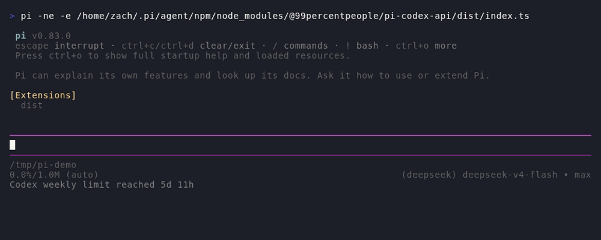
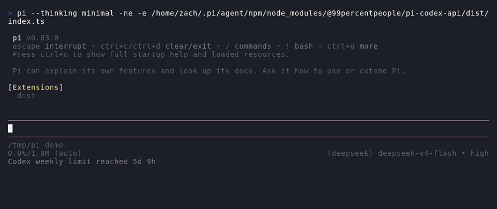
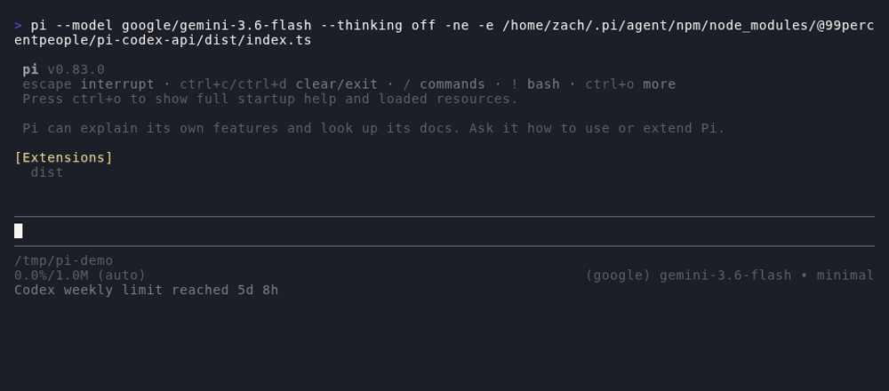

# @99percentpeople/pi-codex-api

Turn your ChatGPT subscription into Pi superpowers — image generation, web
search, Fast mode, and usage monitoring — **no OpenAI API key required**.

## Highlights

- **Image generation & editing** — `codex_image` creates or edits images via
  your Codex subscription's `gpt-image-2`, and works from **any model**:
  even with a third-party provider active (DeepSeek, Google, …), it reuses Pi's
  logged-in `openai-codex` OAuth account (enable **Other providers** in
  `/99settings`).
- **First-party search** — `codex_search` runs web and image queries, page
  navigation, PDF screenshots, finance, weather, sports, and time lookups, and
  renders clean result cards instead of raw citations.
- **Fast mode** — optional priority service tier for snappier responses.
- **Usage at a glance** — the status bar shows remaining Codex quota and
  reset time; `/codex-usage` shows your plan, masked account, limits, credits,
  and earned rate-limit reset cards.
- **Reset cards** — when you run out of messages, `/codex-redeem` redeems an
  earned reset card safely: pick a card, confirm, done.

## Demo

Subscription usage, limit-reached state, and reset-card redemption:



Web search with clean result cards (search → open a result → summarize):



Image generation with `gpt-image-2` (saved PNG + description):



## Search output

`codex_search` keeps each result family readable:

- Web and image searches render compact source cards.
- `open`, `click`, and `find` render grouped document previews; collapsed output
  shows at most three documents, while expanded output keeps every result.
- Weather forecasts, finance quotes, sports standings/schedules, and time
  lookups render structured cards. Weather alert details are reduced to their
  actionable summaries instead of injecting the provider's full object dump.
- Structured lookup text is compacted before it reaches the model. Other search
  output is bounded to 2,000 lines or 50 KB and tells the model to open fewer
  references if truncation occurs.

For page workflows, search first and open returned reference IDs. Direct URLs
are best effort because Codex's browsing backend can reject otherwise valid
URLs. Keep page-navigation batches to three pages or fewer; `response_length`
and `open.lineno` do not reliably shorten page bodies.

Current Codex backend limitations are surfaced as actionable result hints:

- Weather can become temporarily unavailable even with valid locations; retry
  once, then fall back to web search rather than looping over modes or locations.
- Crypto quotes require bare tickers such as `BTC` or `ETH`, not `BTC-USD`.
- NHL standings are not served by the structured sports lookup.
- `finance.market` is only a provider hint and does not reliably resolve
  international exchange listings such as `0700.HK`.

When a batched lookup silently omits one item, the extension compares returned
reference indexes with the request and reports the missing item's applicable
hint instead of presenting the batch as fully successful.

## Quick start

```bash
pi install npm:@99percentpeople/pi-codex-api
```

Requirements:

- Pi logged in with `/login` for `openai-codex`
- An active `openai-codex` model, or **Other providers** enabled in
  `/99settings` to use the subscription from any model

That's it — just ask *"generate an image of a neon ramen shop"* or *"search
the web for today's Rust releases"* and the model calls the tools for you.

When `@99percentpeople/pi-ssh-remote` is active, `codex_image.output_path` and
`referenced_image_paths` resolve through `@99percentpeople/pi-workspace-files`
and its remote binary backend. Generated
Base64 data is written directly through the remote adapter and references are
read directly from it, without creating local staging files.

## Commands

The commands below are registered only after Pi confirms an `openai-codex`
OAuth login. Sessions that start without Codex login do not show them; login
and model/auth changes are detected during the session. Pi currently has no
command-unregister API, so after logging out in the same running session use
`/reload` (or open another session) to remove commands registered earlier.

### `/codex-usage`

Shows a fresh snapshot of your subscription in one block:

```text
Codex usage

account · Plus (user@example.com)

codex
  weekly [█████████████░░░░░░░] 65% left resets in 5d 3h
  no additional credits

rate limit redeem
  Full reset (available, expires 2026-08-13 02:14 UTC+8)
```

- Plan type and masked email from Codex's official usage endpoint
- Each limit window shows remaining capacity as a bar; when exhausted it reads
  `limit reached` instead of `0% left`
- Earned reset cards, sorted by expiry, with local-time expiry timestamps
- The status bar mirrors this compactly: `Codex weekly 65% 5d 3h` →
  `Codex weekly limit reached 5d 14h`
- When a refresh fails the status never stays on the transient
  `Codex syncing…`: expired/invalid OAuth tokens show `Codex auth expired — /login`
  (red), other failures keep the last known usage or show `Codex usage unavailable`
  until the next successful refresh

Usage refreshes automatically on session start and model select;
`/codex-usage` always forces a fresh read. Every usage request is capped at a
15-second timeout so a stalled backend cannot leave the status bar spinning.

### `/codex-redeem`

Redeems an earned rate-limit reset card when you're out of messages:

```text
──────────────────────────────────────────────
Select a reset credit to redeem (30s)

→ Full reset (expires 2026-08-03)
  Full reset (expires 2026-08-12)

↑↓ navigate  ↵ select  esc cancel
──────────────────────────────────────────────
      ↓ pick a card
──────────────────────────────────────────────
Redeem Full reset (expires 2026-08-12)? (30s)

→ No
  Yes

↑↓ navigate  ↵ select  esc cancel
──────────────────────────────────────────────
```

- Multiple cards show a picker (earliest expiry first); a single card skips to
  confirmation
- **No is the default**, so a stray Enter never consumes anything
- Redemptions are idempotent: a retry after a network failure can never consume
  a second card
- Without dialog UI, it falls back to a two-step confirm flow

## Settings

Configure under **Codex API** in `/99settings`:

- **Other providers** — let any model (DeepSeek, Google, …) use the logged-in
  Codex subscription
- **Fast mode** — priority service tier (lower latency, faster limit use)
- **Search** — auto routing (Cached / Indexed / Live per call) or a fixed mode,
  plus context size
- **Image quality** — default GPT Image 2 quality
- **Usage status** — show or hide the Codex quota line in the status bar

Settings live in `~/.pi/agent/99extensions.json` under the `codex-api`
namespace.

## How it works

- Reuses Pi's existing `openai-codex` OAuth — no API key, no MCP server, no
  separate search provider
- Tokens are fetched per call from Pi's model registry, never stored in
  settings or tool results
- Images and search requests go to OpenAI's Codex backend and follow your
  ChatGPT workspace's policies
- The extension also ships the **`gpt-image-prompts`** skill for crafting
  production-grade image prompts — invoke it with `/skill:gpt-image-prompts`

## Development

```bash
bun run build:packages
bun run --cwd extensions/codex-api build
pi install ./extensions/codex-api
```
